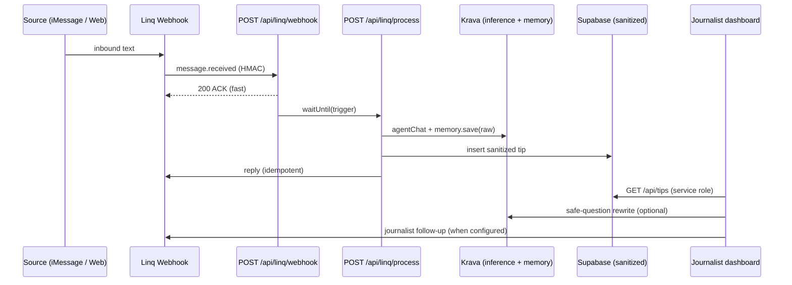

# SourceShield

**Pseudonymous two-way newsroom tips** — sources reach out over iMessage (Linq) or web intake; journalists see **sanitized case cards** and send **safe follow-ups**. Raw text never lands in your database.

Built for the **Krava × Linq** hackathon. Live demo: [source-shield.vercel.app](https://source-shield.vercel.app)

---

## The problem

Whistleblowers and tipsters need to talk to journalists without doxxing themselves in the newsroom’s systems. Journalists need enough context to pursue a story without storing identifying details in Slack, email, or a shared CMS.

SourceShield sits in the middle: **private intake and memory on Krava**, **live messaging on Linq**, **sanitized state in Supabase**.

---

## What judges should see in 60 seconds

1. **[Web intake](https://source-shield.vercel.app/intake)** — Submit a tip with a name, date, and dollar amount. The UI shows **raw (Krava-only)** vs **sanitized (dashboard/Postgres)** side by side.
2. **[Dashboard](https://source-shield.vercel.app/dashboard)** — Select the card. Type an unsafe follow-up (*“Did John Smith say this on March 3rd?”*). Watch it **rewrite** before send (dry-run without Linq; live send with Linq).
3. **Resume with your case code** — Submit again using the case code from step 1; Krava memory can **recall prior context** (when the Krava key is live). No browser-stored session.

The landing page **system status chips** probe Krava and Supabase in real time — degraded mode is visible, not hidden behind “No tips yet.”

---

## How privacy is enforced

| Data | Where it lives | Who sees it |
|------|----------------|-------------|
| Raw transcripts | **Krava encrypted memory** (per-source user) | Server only; never in Postgres |
| Sanitized summary, duress flag, claim fingerprint | **Supabase `tips`** | Journalist dashboard |
| Phone / chat identifiers | Server + Linq only | **Not** exposed on dashboard API |
| Journalist follow-up drafts | Rewritten in-app | Source sees safe version on iMessage |

**Split-storage rule:** if it can identify someone in a newsroom tool, it does not go in the app DB.

We say **pseudonymous**, not anonymous — Linq, Apple, and carriers still see phone metadata. See [Limits & scope](/limits) for the full honest list.

---

## Architecture



**ACK-first webhook** — Linq’s ~10s timeout and at-least-once delivery are handled by deduping `event_id`, returning 200 immediately, and processing in a background worker (`waitUntil` on Vercel).

---

## Krava integration

| Capability | Implementation |
|------------|----------------|
| Private inference | `kimi-k2-5` via Krava `agentChat` — JSON intake (reply, summary, duress, claims, suggested question) |
| Encrypted memory | `memory.save` for raw transcripts; `memory.search` for multi-turn continuity |
| Per-source scope | `users.getOrCreate` keyed by hashed handle (`source:<hash>`) |
| Safe follow-ups | Regex strip + optional Krava rewrite for journalist questions |
| Corroboration fallback | Second LLM pass to group similar sanitized claims |
| Degradation | 401 / API errors → **mock intake** with heuristic sanitization (demo still runs) |

```bash
npm run krava:doctor   # checks KRAVA_APP_KEY + provisioning
```

---

## Linq integration

| Piece | Detail |
|-------|--------|
| Webhook | `message.received` only; HMAC verify + 5‑min replay window |
| Outbound | `idempotency_key` on every send (SDK `message` shape) |
| Version | Webhook URL pinned to `?version=2026-02-03` (`MessageEventV2`) |
| Register | `npm run register-webhook` after deploy |

Without Linq keys, follow-ups run in **preview (dry-run)** mode — intentional for conference demos.

---

## Tech stack

- **Next.js 16** (App Router) on **Vercel**
- **Supabase** (Postgres + RLS)
- **Krava** (`@kravalabs/api-client`)
- **Linq** (`@linqapp/sdk`)
- **TypeScript**, **Zod**, **Tailwind CSS**

---

## Quick start (local)

```bash
git clone https://github.com/kathangabani-nyu/SourceShield.git
cd SourceShield
npm install
```

Create `.env.local` (see [Environment variables](#environment-variables) below).

Apply Supabase migrations **in order**:

1. [`supabase/migrations/001_initial.sql`](supabase/migrations/001_initial.sql)
2. [`supabase/migrations/002_tips_realtime_rls.sql`](supabase/migrations/002_tips_realtime_rls.sql)
3. [`supabase/migrations/003_privacy_and_suggestions.sql`](supabase/migrations/003_privacy_and_suggestions.sql)

```bash
npm run dev
# → http://localhost:3000
```

| Route | Purpose |
|-------|---------|
| `/` | Overview + live integration status |
| `/intake` | Web tip path (case-code continuity — no browser session) |
| `/dashboard` | Journalist case cards + safe follow-up |
| `/limits` | Full “what we do not claim” |
| `/api/health` | Probes Krava + Supabase (JSON) |

---

## Environment variables

Server-only secrets must **never** use the `NEXT_PUBLIC_` prefix.

| Variable | Required | Description |
|----------|----------|-------------|
| `NEXT_PUBLIC_SUPABASE_URL` | Yes | Supabase project URL |
| `NEXT_PUBLIC_SUPABASE_ANON_KEY` | Yes | Anon key (client; dashboard polls via API) |
| `SUPABASE_SERVICE_ROLE_KEY` | Yes | Server writes + `/api/tips` — **must be set on Vercel Production** |
| `KRAVA_APP_KEY` | For live AI | Hackathon app key from Krava; mock fallback if missing/401 |
| `KRAVA_BASE_URL` | Optional | Default `https://krava.io` |
| `LINQ_API_KEY` | For iMessage | Linq API key |
| `LINQ_WEBHOOK_SECRET` | For iMessage | Webhook HMAC secret |
| `LINQ_PHONE_NUMBER` | For iMessage | Registered Linq number |
| `INTERNAL_WORKER_SECRET` | Production | Protects `/api/linq/process`, `/api/seed`; webhook→worker auth |
| `DASHBOARD_SECRET` | Production | Protects `/api/tips` and follow-up; unlock UI stores in `sessionStorage` |
| `NEXT_PUBLIC_APP_URL` | Deploy | Production URL (e.g. `https://source-shield.vercel.app`) — not `localhost` on Vercel |
| `NEXT_PUBLIC_ONION_URL` | Optional | `.onion` mirror URL shown on `/intake` for Tor-first sources |

Generate secrets (PowerShell):

```powershell
[Convert]::ToBase64String((1..32 | ForEach-Object { Get-Random -Maximum 256 }) -as [byte[]])
```

---

## Deploy (Vercel)

The repo is wired for **auto-deploy from `main`**.

1. Import the GitHub repo in [Vercel](https://vercel.com).
2. Set all variables above for **Production** (and **Preview** if you demo on preview URLs).
3. Redeploy after changing env vars.
4. Open `/dashboard` → enter `DASHBOARD_SECRET` once to unlock.

**Production checklist**

- [ ] `SUPABASE_SERVICE_ROLE_KEY` set → `/api/health` shows **Sanitized DB — live**
- [ ] Valid `KRAVA_APP_KEY` → **Krava private inference — live**
- [ ] `DASHBOARD_SECRET` + `INTERNAL_WORKER_SECRET` set
- [ ] `NEXT_PUBLIC_APP_URL` matches the Vercel hostname
- [ ] Optional: `npm run register-webhook` when Linq keys arrive

---

## Demo without Linq (conference fallback)

1. Submit a tip at `/intake` — confirm raw vs sanitized panels.
2. Unlock `/dashboard` with `DASHBOARD_SECRET`.
3. Click **Load demo case cards** (or `POST /api/demo/seed` with dashboard auth) for corroboration examples.
4. Select a card → **Preview rewrite (dry-run)** with an identifying question.

```bash
# Worker seed (corroboration baseline)
curl -X POST https://source-shield.vercel.app/api/seed \
  -H "Authorization: Bearer $INTERNAL_WORKER_SECRET"

# Dashboard seed (same data, uses DASHBOARD_SECRET)
curl -X POST https://source-shield.vercel.app/api/demo/seed \
  -H "Authorization: Bearer $DASHBOARD_SECRET"
```

Full talk track: [`docs/demo-rehearsal.md`](docs/demo-rehearsal.md)

---

## API routes

| Method | Path | Auth | Role |
|--------|------|------|------|
| `GET` | `/api/health` | Public | Live probes + integration status |
| `POST` | `/api/intake/web` | Public | Web tip intake |
| `GET` | `/api/tips` | `DASHBOARD_SECRET` (prod) | List sanitized cards |
| `POST` | `/api/tips/[id]/follow-up` | `DASHBOARD_SECRET` (prod) | Rewrite (+ Linq send if configured) |
| `POST` | `/api/demo/seed` | `DASHBOARD_SECRET` (prod) | Demo case cards |
| `POST` | `/api/seed` | `INTERNAL_WORKER_SECRET` (prod) | Same seed via worker secret |
| `POST` | `/api/linq/webhook` | HMAC | Linq ingress (ACK-first) |
| `POST` | `/api/linq/process` | `INTERNAL_WORKER_SECRET` (prod) | Background worker |

---

## Scripts

| Command | Description |
|---------|-------------|
| `npm run dev` | Local Next.js dev server |
| `npm run build` | Production build |
| `npm run lint` | ESLint |
| `npm run krava:doctor` | Validate Krava key + connectivity |
| `npm run register-webhook` | Register Linq webhook to `NEXT_PUBLIC_APP_URL` |

---

## Project structure

```
src/
  app/
    api/          # Webhook, worker, intake, tips, health
    dashboard/    # Journalist UI
    intake/       # Web fallback
    limits/       # Honest scope page
  lib/
    krava/        # LLM intake, memory, chat stream
    linq/         # Client, webhook verify, extract text
    supabase/     # Admin + browser clients
  components/     # Integration status chips
supabase/migrations/
docs/             # Setup, API verification, rehearsal, free tier
```

---

## Documentation

- [Supabase setup](docs/supabase-setup.md) — project `bsarszpxxsntohgazmsy`
- [API verification (Task Zero)](docs/api-verification.md) — Linq + Krava shapes
- [Demo rehearsal](docs/demo-rehearsal.md) — 2‑minute talk track
- [Web intake anonymity](docs/anonymity.md) — threat model, Tor, case codes, CSP
- [Free tier / $0 runbook](docs/free-tier.md)
- [Design decisions](DECISIONS.md)

---

## Honest limits (short)

- **Pseudonymous ≠ anonymous** — metadata exists outside our DB.
- **Similar claim ≠ independent corroboration** — channel count is a signal, not proof.
- **Coercion flag** — model signal; bot pauses neutrally, never asks “Are you being forced?”
- **Web path** — case-code continuity (no `localStorage`); see [anonymity model](docs/anonymity.md).

[Full limits →](/limits) (or [live](https://source-shield.vercel.app/limits))

---

## License

Hackathon project — see repository for terms.

---

<p align="center">
  <strong>SourceShield</strong> — raw tips stay in Krava; journalists work on sanitized truth.
</p>
