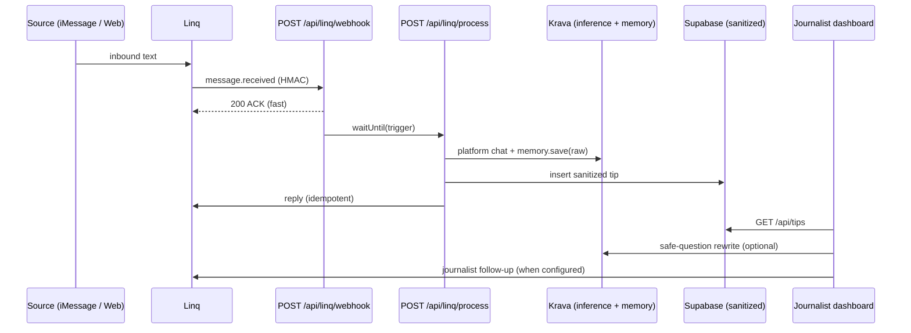

# SourceShield

**Pseudonymous two-way newsroom tips** — sources reach out over iMessage (Linq) or anonymous web intake; journalists see **sanitized case cards** and send **safe follow-ups**. Raw text never lands in your database.

Live: [source-shield.vercel.app](https://source-shield.vercel.app)

---

## The problem

Whistleblowers and tipsters need to talk to journalists without doxxing themselves in the newsroom’s systems. Journalists need enough context to pursue a story without storing identifying details in Slack, email, or a shared CMS.

SourceShield sits in the middle: **private intake and memory on Krava**, **live messaging on Linq**, **sanitized state in Supabase**.

**Split-storage rule:** if it can identify someone in a newsroom tool, it does not go in the app DB.

---

## Workflow (three paths)

### 1. iMessage (Linq) — pseudonymous two-way

1. Source texts the newsroom Linq number.
2. Linq posts `message.received` to `POST /api/linq/webhook` (HMAC-verified).
3. Webhook **ACKs immediately** (`waitUntil` → background worker) — handles Linq’s ~10s timeout and at-least-once delivery.
4. Worker runs Krava intake LLM, saves **raw** to Krava `memory.save`, inserts **sanitized** row in Supabase, replies via Linq with an idempotent key (`reply-{event_id}`).

Phone handles are **SHA-256 hashed** before storage; `linq_chat_id` stays server-side only.

### 2. Web intake — anonymous at the application layer

1. Source submits at [`/intake`](https://source-shield.vercel.app/intake) — no login, no phone, no `localStorage` session, no analytics.
2. Server issues a **case code** (UUIDv4) or resumes with one the user holds.
3. Channel identity is `hash("web:" + sessionId)` — same Krava + Supabase pipeline as iMessage.
4. `memory.search` can recall prior context when the user returns with their case code.

`POST /api/intake/web` does not read or persist IP/User-Agent; `Cache-Control: no-store`. Network anonymity is Tor/onion — see [docs/anonymity.md](docs/anonymity.md).

### 3. Journalist dashboard

1. Journalists see sanitized summaries, duress signals, suggested safe questions, and similar-claim grouping (metadata only).
2. Unsafe follow-ups (e.g. *“Did John Smith say this on March 3rd?”*) go through **regex strip**, then optional **Krava rewrite**, before Linq send.
3. **Dry-run** works without Linq (web-only tips); live send when Linq keys are configured.

---

## Quick tour

1. **[Web intake](https://source-shield.vercel.app/intake)** — Submit a tip with a name, date, and dollar amount. The UI shows **raw (Krava-only)** vs **sanitized (dashboard/Postgres)** side by side.
2. **[Dashboard](https://source-shield.vercel.app/dashboard)** — Select a card. Type an unsafe follow-up. Watch it **rewrite** before send (dry-run without Linq; live send with Linq).
3. **Resume with your case code** — Submit again using the case code from step 1; Krava memory can **recall prior context** (when the Krava key is live).
4. **[Story](https://source-shield.vercel.app/story)** (optional) — Scroll-through narrative mapping Krava’s four guarantees to SourceShield, with live intake and dashboard scenes.

The landing page **system status chips** probe Krava and Supabase in real time — degraded mode is visible, not hidden behind “No tips yet.”

---

## How privacy is enforced

| Data | Where it lives | Who sees it |
|------|----------------|-------------|
| Raw transcripts | **Krava encrypted memory** (per-source user) | Server only; never in Postgres |
| Sanitized summary, duress flag, claim fingerprint | **Supabase `tips`** | Journalist dashboard |
| Phone / chat identifiers | Server + Linq only | **Not** exposed on dashboard API |
| Journalist follow-up drafts | Rewritten in-app | Source sees safe version on iMessage |

iMessage is **pseudonymous** at the app layer (Linq, Apple, and carriers still see phone metadata). Web intake is **anonymous at the app layer** on the hosted site; Tor + self-hosted onion is the strongest network path. Details: [docs/anonymity.md](docs/anonymity.md).

---

## Architecture



**ACK-first webhook** — dedupe `event_id` in Postgres, return 200 immediately, process in a background worker (`waitUntil` on Vercel).

---

## Krava integration

SourceShield uses four Krava primitives end-to-end:

| Guarantee | SourceShield usage |
|-----------|-------------------|
| **Pseudonymous identity** | `users.getOrCreate("source:" + SHA-256(handle))` → scoped `userToken` per source |
| **Secure memory** | `memory.save` for raw transcripts; `memory.search` for multi-turn continuity (AES-256-GCM) |
| **Private LLM** | Structured JSON intake — reply, sanitized summary, duress signal, claims, safe question |
| **Private inference path** | Chat via `POST /api/platform/chat` (Bearer `userToken`, SSE) — BYO-agent path, not OpenClaw gateway |

| Capability | Implementation |
|------------|----------------|
| Dual clients | Platform client (`KRAVA_APP_KEY`) for provisioning; per-user client with `userToken` for memory + chat |
| Intake output | Zod-validated JSON: `assistant_reply`, `sanitized_summary`, `duress_signal`, `claims[]`, `next_safe_question` |
| Duress handling | High signal → fixed neutral pause reply; never asks “Are you being forced?” |
| Safe follow-ups | Regex strip → optional Krava rewrite (`via: regex \| regex+krava`) |
| Corroboration | Fingerprint match, then second LLM pass on **sanitized** summaries only |
| Degradation | Missing/401 key → **mock intake** with heuristic sanitization |

```bash
npm run krava:doctor   # checks KRAVA_APP_KEY + provisioning
```

Memory save failures are **non-blocking** — the source still gets a reply and a sanitized card.

---

## Linq integration

| Piece | Detail |
|-------|--------|
| Webhook | `message.received` only; HMAC verify + replay window |
| Outbound | `idempotency_key` inside SDK `message` shape |
| Version | Webhook URL pinned to `?version=2026-02-03` (`MessageEventV2`) |
| Register | `npm run register-webhook` after deploy |
| Media | Text-only policy — media-only inbound gets a safety reply, no blob storage in DB |

Without Linq keys, follow-ups run in **preview (dry-run)** mode.

---

## Tech stack

- **Next.js 16** (App Router) on **Vercel**
- **Supabase** (Postgres + RLS)
- **Krava** (`@kravalabs/api-client`)
- **Linq** (`@linqapp/sdk`)
- **TypeScript**, **Zod**, **Tailwind CSS**

---

## Quick start (local)

```bash
git clone https://github.com/kathangabani-nyu/SourceShield.git
cd SourceShield
npm install
```

Create `.env.local` (see [Environment variables](#environment-variables) below).

Apply Supabase migrations **in order**:

1. [`supabase/migrations/001_initial.sql`](supabase/migrations/001_initial.sql)
2. [`supabase/migrations/002_tips_realtime_rls.sql`](supabase/migrations/002_tips_realtime_rls.sql)
3. [`supabase/migrations/003_privacy_and_suggestions.sql`](supabase/migrations/003_privacy_and_suggestions.sql)

```bash
npm run dev
# → http://localhost:3000
```

| Route | Purpose |
|-------|---------|
| `/` | Overview + live integration status |
| `/intake` | Anonymous web tips + case-code continuity |
| `/dashboard` | Journalist case cards + safe follow-up |
| `/story` | Scroll-through Krava × SourceShield narrative |
| `/api/health` | Probes Krava + Supabase (JSON) |

---

## Environment variables

Server-only secrets must **never** use the `NEXT_PUBLIC_` prefix.

| Variable | Required | Description |
|----------|----------|-------------|
| `NEXT_PUBLIC_SUPABASE_URL` | Yes | Supabase project URL |
| `NEXT_PUBLIC_SUPABASE_ANON_KEY` | Yes | Anon key (client; dashboard polls via API) |
| `SUPABASE_SERVICE_ROLE_KEY` | Yes | Server writes + `/api/tips` — **must be set on Vercel Production** |
| `KRAVA_APP_KEY` | For live AI | Krava app key; mock fallback if missing/401 |
| `KRAVA_BASE_URL` | Optional | Default `https://krava.io` |
| `LINQ_API_KEY` | For iMessage | Linq API key |
| `LINQ_WEBHOOK_SECRET` | For iMessage | Webhook HMAC secret |
| `LINQ_PHONE_NUMBER` | For iMessage | Registered Linq number |
| `INTERNAL_WORKER_SECRET` | Production | Protects `/api/linq/process`, `/api/seed`; webhook→worker auth |
| `DASHBOARD_SECRET` | Production | Protects `/api/tips` and follow-up; unlock UI stores in `sessionStorage` |
| `NEXT_PUBLIC_APP_URL` | Deploy | Production URL (e.g. `https://source-shield.vercel.app`) — not `localhost` on Vercel |
| `NEXT_PUBLIC_ONION_URL` | Optional | `.onion` mirror URL shown on `/intake` for Tor-first sources |

Generate secrets (PowerShell):

```powershell
[Convert]::ToBase64String((1..32 | ForEach-Object { Get-Random -Maximum 256 }) -as [byte[]])
```

---

## Deploy (Vercel)

The repo is wired for **auto-deploy from `main`**.

1. Import the GitHub repo in [Vercel](https://vercel.com).
2. Set all variables above for **Production** (and **Preview** if you use preview URLs).
3. Redeploy after changing env vars.
4. Open `/dashboard` → enter `DASHBOARD_SECRET` once to unlock.

**Production checklist**

- [ ] `SUPABASE_SERVICE_ROLE_KEY` set → `/api/health` shows **Sanitized DB — live**
- [ ] Valid `KRAVA_APP_KEY` → **Krava private inference — live**
- [ ] `DASHBOARD_SECRET` + `INTERNAL_WORKER_SECRET` set
- [ ] `NEXT_PUBLIC_APP_URL` matches the Vercel hostname
- [ ] Optional: `npm run register-webhook` when Linq keys are configured

---

## Running without Linq

1. Submit a tip at `/intake` — confirm raw vs sanitized panels.
2. Unlock `/dashboard` with `DASHBOARD_SECRET`.
3. Click **Load sample cases** (or `POST /api/demo/seed` with dashboard auth) for corroboration examples.
4. Select a card → **Preview rewrite (dry-run)** with an identifying question.

```bash
# Worker seed (corroboration baseline)
curl -X POST https://source-shield.vercel.app/api/seed \
  -H "Authorization: Bearer $INTERNAL_WORKER_SECRET"

# Dashboard seed (same data, uses DASHBOARD_SECRET)
curl -X POST https://source-shield.vercel.app/api/demo/seed \
  -H "Authorization: Bearer $DASHBOARD_SECRET"
```

---

## API routes

| Method | Path | Auth | Role |
|--------|------|------|------|
| `GET` | `/api/health` | Public | Live probes + integration status |
| `POST` | `/api/intake/web` | Public | Web tip intake (`Cache-Control: no-store`) |
| `GET` | `/api/tips` | `DASHBOARD_SECRET` (prod) | List sanitized cards |
| `POST` | `/api/tips/[id]/follow-up` | `DASHBOARD_SECRET` (prod) | Rewrite (+ Linq send if configured) |
| `POST` | `/api/demo/seed` | `DASHBOARD_SECRET` (prod) | Sample case cards |
| `POST` | `/api/seed` | `INTERNAL_WORKER_SECRET` (prod) | Same seed via worker secret |
| `POST` | `/api/linq/webhook` | HMAC | Linq ingress (ACK-first) |
| `POST` | `/api/linq/process` | `INTERNAL_WORKER_SECRET` (prod) | Background worker |

---

## Scripts

| Command | Description |
|---------|-------------|
| `npm run dev` | Local Next.js dev server |
| `npm run build` | Production build |
| `npm run lint` | ESLint |
| `npm run krava:doctor` | Validate Krava key + connectivity |
| `npm run register-webhook` | Register Linq webhook to `NEXT_PUBLIC_APP_URL` |

---

## Project structure

```
src/
  app/
    api/          # Webhook, worker, intake, tips, health
    dashboard/    # Journalist UI
    intake/       # Anonymous web intake
    story/        # Krava × SourceShield scroll narrative
  lib/
    krava/        # Platform chat, memory, intake LLM, safe rewrite
    linq/         # Client, webhook verify, extract text
    supabase/     # Admin + browser clients
  components/     # Integration status chips, story scenes
supabase/migrations/
docs/             # Setup, API verification, anonymity
```

---

## Documentation

- [Supabase setup](docs/supabase-setup.md) — project `bsarszpxxsntohgazmsy`
- [API verification (Task Zero)](docs/api-verification.md) — Linq + Krava shapes
- [Web intake anonymity](docs/anonymity.md) — threat model, Tor, case codes, CSP
- [Design decisions](DECISIONS.md)

---

<p align="center">
  <strong>SourceShield</strong> — raw tips stay in Krava; journalists work on sanitized truth.
</p>
